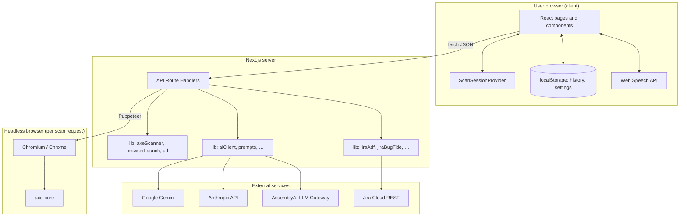
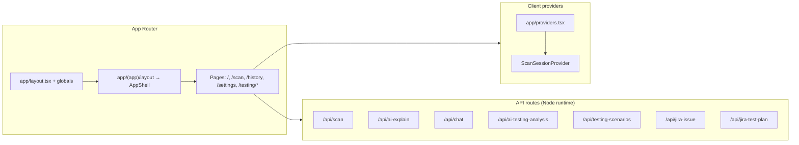
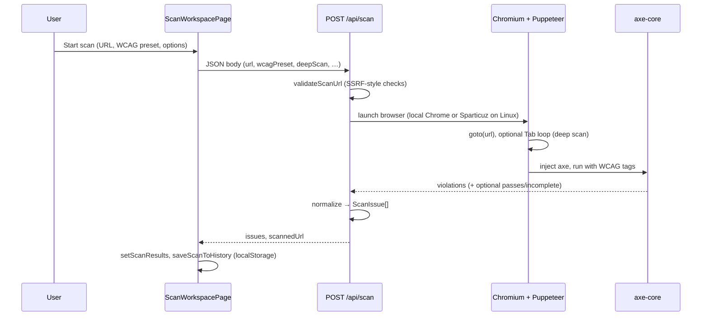
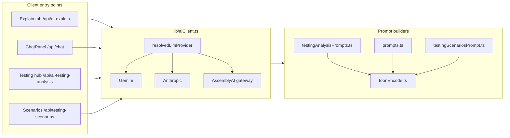
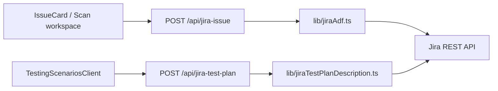
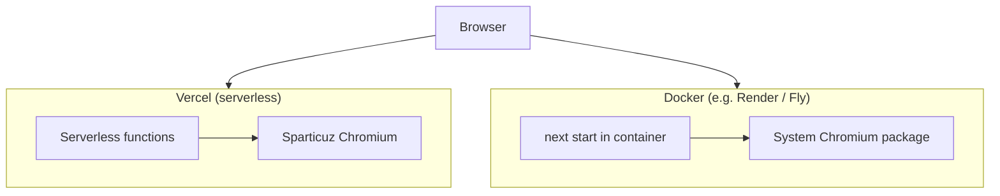

# A11yAgent — Architecture

This document describes how the application is structured, how data flows, and which external systems it depends on. It is aimed at developers onboarding to the codebase or planning deployments.

---

## 1. Summary

**A11yAgent** is a **Next.js 16 (App Router)** application. The **browser** runs a React UI with client-side state for the current scan. **Server Route Handlers** (`app/api/*/route.ts`) perform heavy work: headless **Chromium** loads target URLs, **axe-core** collects accessibility violations, and **LLM APIs** produce explanations, chat, and testing-hub reports. Optional **Jira Cloud REST** integration creates issues from the UI.

**Persistence on the device:** scan history and user display settings live in **`localStorage`** (not a central database). **Secrets** (API keys) live in **environment variables** on the server (e.g. `.env.local` locally, Vercel/Render env in production).

---

## 2. High-level system diagram

---

## 3. Application layers

| Layer | Responsibility |
|--------|----------------|
| **Root layout** | Fonts, metadata, dark theme shell, wraps `Providers`. |
| **`(app)` layout** | `AppShell`: sidebar, nav, profile strip, Suspense fallback. |
| **Pages** | Route-specific UI; most interactive pages are `"use client"`. |
| **`Providers`** | Applies reduced-motion from settings; provides **scan session** (URL + issues + scan-in-progress flags). |
| **API routes** | Stateless request handlers; read `process.env`; return JSON. |

---

## 4. Scan pipeline (core flow)

**Important files**

- `app/api/scan/route.ts` — orchestrates Puppeteer, axe, timeouts (`maxDuration`).
- `lib/browserLaunch.ts` — **macOS/Windows:** installed Chrome/Edge; **Linux/Vercel:** `@sparticuz/chromium` when `PUPPETEER_EXECUTABLE_PATH` is unset.
- `lib/axeScanner.ts` — normalizes axe output into app **`ScanIssue`** shape.
- `lib/url.ts` — URL validation for scans.
- `lib/wcagAxeTags.ts` — maps WCAG preset → axe tags.
- `lib/scanCookies.ts` — validates optional **`cookies`** JSON for **`POST /api/scan`** (domain must match scan host; size caps).

### Sign-in workflow (UI) and authenticated scan

- **Sign-in prep (UI):** In **`components/NewScanLayout.tsx`**, **Page may need a sign-in** shows **Sign-in prep** when the URL validates: open/copy URL, optional **Import session cookies** (`
` + JSON textarea), then **Start scan**.
- **Cookie import (API):** **`POST /api/scan`** accepts **`cookies`** (JSON array) only when **`requiresLogin`** is true. **`app/api/scan/route.ts`** calls **`page.setCookie`** before **`page.goto`**. Response **`meta.cookiesApplied`** counts applied rows; **`meta.requiresLoginNote`** reflects whether cookies were used. Cookies are not persisted.

---

## 5. AI and chat flows

- **`lib/aiClient.ts`** centralizes provider selection (`LLM_PROVIDER` or key precedence), retries (e.g. Gemini 429), and fallbacks between providers.
- **`lib/prompts.ts`** — explain + chat system/user prompts.
- **`lib/toonEncode.ts`** — encodes structured scan/issue payloads as **TOON** ([`@toon-format/toon`](https://www.npmjs.com/package/@toon-format/toon)) for fewer tokens than JSON in LLM requests (testing reports, explain, manual scenarios, and **`buildChatSystemPrompt`** scan summary + focused issue).
- **`lib/issueSanitize.ts`** / **`sanitizeIssueForApi`** (re-exported from `clientApi.ts`) trim payloads sent to APIs.

---

## 6. Jira integration

Environment variables (see `.env.example`) configure host, project, issue types, and optional ADF/custom fields.

---

## 7. Client-side storage (no backend DB)

| Key / module | Data |
|--------------|------|
| `lib/scanHistory.ts` | Saved scans: URL, counts, `byImpact`, optional samples. |
| `lib/userSettings.ts` | Display name, email (cosmetic), reduced motion. |
| `lib/explainWindowTransfer.ts` | Short-lived handoff to `/scan/explain` (sessionStorage pattern). |

The **dashboard** reads history via `loadScanHistory()` after mount so server-rendered HTML does not depend on private browser data.

---

## 8. Deployment shapes

- **Vercel:** `vercel.json` configures memory/duration for scan and long AI routes; no `PUPPETEER_EXECUTABLE_PATH` needed on Linux.
- **Docker:** `Dockerfile` installs Chromium and sets `PUPPETEER_EXECUTABLE_PATH=/usr/bin/chromium`.

---

## 9. Security and operations (short)

- **Scan URL** validation reduces naive SSRF; a public scanner still needs **rate limits**, **auth**, and monitoring for production abuse.
- **API keys** never ship to the client for server routes; only public env vars exposed via `NEXT_PUBLIC_*` would be (this project minimizes those).
- **Voice** uses the browser **Web Speech API** (Google’s recognition in Chrome); requires HTTPS or localhost for a secure context.

---

## 10. Key directory map

| Path | Role |
|------|------|
| `app/(app)/` | Authenticated-style app shell routes (dashboard, scan, history, settings). |
| `app/testing/` | AI testing hub marketing/runner pages. |
| `app/api/` | REST-like JSON endpoints for scan, AI, Jira. |
| `components/` | UI: shell, scan workspace, lists, voice, chat, testing runners. |
| `lib/` | Domain logic: axe, AI, Jira, exports, voice commands, WCAG tags. |
| `hooks/` | `useDebouncedValue`, `useLiveSpeechRecognition`. |

---

## 11. Diagram source

Diagrams use **[Mermaid](https://mermaid.js.org/)**. They render on GitHub when viewing this file; in VS Code / Cursor, use a Mermaid preview extension if needed.

For a single-page **runtime view** (what runs where on one request), combine sections **2**, **4**, and **5**: browser calls **`/api/scan`** → Chromium + axe → JSON issues → optional **`/api/ai-explain`** or **`/api/chat`** with **`lib/aiClient`**.
